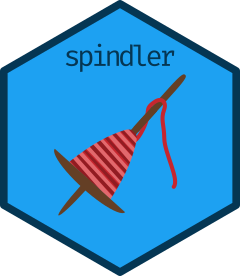
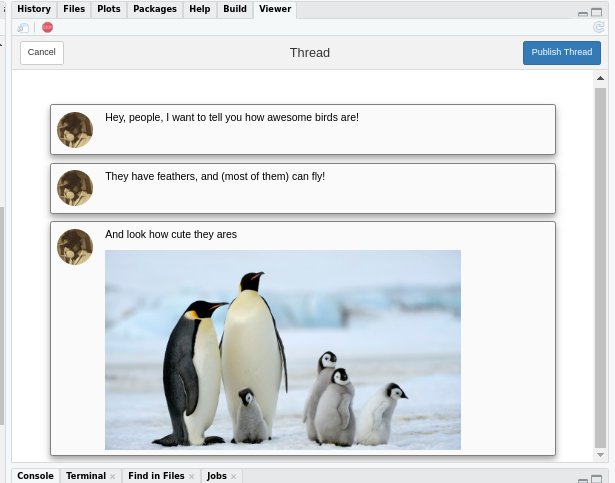

# spindler 

<!-- badges: start -->
[](https://www.tidyverse.org/lifecycle/#experimental)
<!-- badges: end -->

The goal of spindler is to extend reproducible reporting to Twitter threads. Simply by adding a few lines into a rmarkdown document, you can publish a thread with selected results and short comments. 

## Installation

You can install the development version from [GitHub](https://github.com) with:

<!-- the released version of spindler from [CRAN](https://CRAN.R-project.org) with:

``` r
install.packages("spindler")
```

And  --> 

``` r
# install.packages("devtools")
devtools::install_github("eliocamp/spindler")
```

## Setup

Spinder uses [rtweet](https://rtweet.info) to publish your tweets, so you'll need to 
go over its basic configuration of [obtaining and using access tokens](https://rtweet.info/articles/auth.html).


**NOTICE:** 
There's currently [a bug](https://github.com/mkearney/rtweet/issues/329) in the latest version of rtweet that prevents it from posting tweets. Until it is fixed this package will not work properly. You can workaround the issue by installing an older version with 

```r
devtools::install_github("mkearney/rtweet", ref = "79fdf4aa7d219793bf2b201ce059f3bd6395bc7b")
```

### Manually crafted:

```r
birds <- spindler::thread$new()
birds$add_post("Hey, people, I want to tell you how awesome birds are!")$
  add_post("They have feathers, and (most of them) can fly!")$
  add_post("And look how cute they ares", media = "~/Pictures/penguin1.png")
```

Take a look at it either in plain text format by printing it:

```r
birds
#> 1: Hey, people, I want to tell you how awesome birds are!
#>    | 
#> 2: They have feathers, and (most of them) can fly!
#>    | 
#> 3: And look how cute they ares
#>    /home/elio/Pictures/penguin1.png
#>    |
```

Or with a shiny app: 

```r
birds$preview()
```




All looks good, let's publish it and open it in a browser. 

```r
birds$publish()
birds$browse()
```

Oh, no I made a typo. Quick, delete the whole thing!
```{r}
birds$destroy()
```

Let's start over

```{r}
birds$clear()$
  add_post("Nooo! I had an awesome thread about birds, but I messed up.")$
  add_post("So here's the jist of it: birds rock and they are better than monkeys!")$
  publish()
```


### From knitr

Create a new thread object with a tag assigned. 

````r
```{r, setup}
this_thread <- spindler::thread$new(tag = "tw_status")
```
````

Now if you add the `tw_status` option to a chunk with the text you want to tweet, it will be added to the thread along with its first figure (if there is one) during the rendering process.

````r
```{r, tw_status = "The relationship between pressure and temperature is cool!"}
plot(pressure)
```
````

You can also use `this_thread$add_post()` inside your knitr document to add posts manually. At the point where you want to publish your post, do it from inside a new chunk. It's recomended that you also save your thread. 

````r
```{r}
this_thread$publish()$save()$browse()
```
````

Afterwards you can load the latests saved thread with `thread$new()$load()`.
